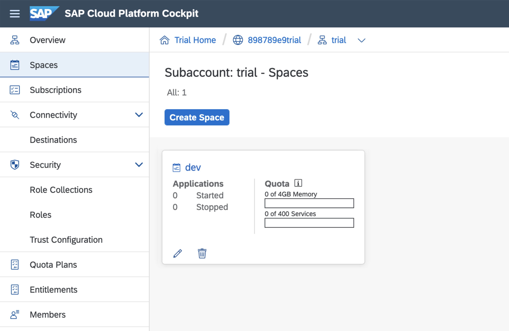
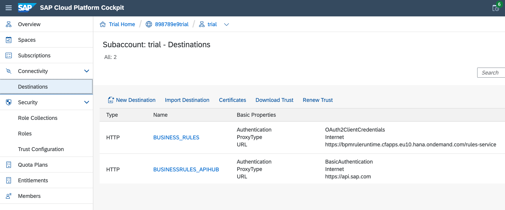
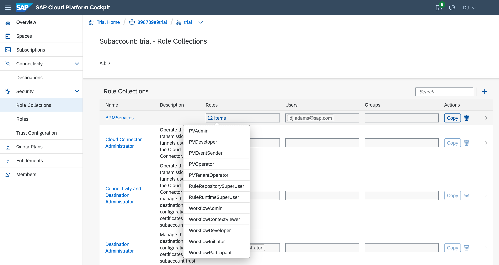
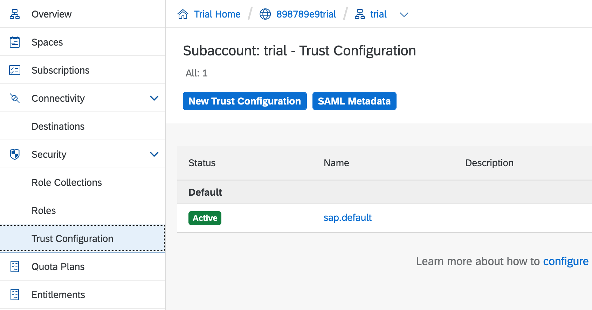
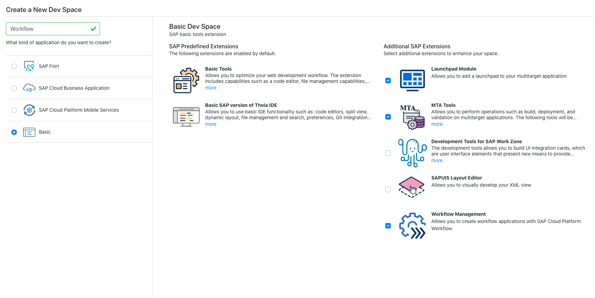

# Exercise 01 - Setting up for Workflow on Cloud Platform

In this exercise you'll set up and configure the basic aspects that you'll need to complete this Workflow Virtual Event on SAP Cloud Platform, specifically in the Cloud Foundry (CF) environment.

This exercise assumes you have a fresh SAP Cloud Platform trial account; you may have to make adjustments if you've used some of your quota already on an existing trial account.

From a service perspective, you'll be using a number of services:

- Workflow: the engine and infrastructure that supports workflow generally
- Portal: to support the Fiori Launchpad (FLP) site which will host the Workflow-related apps
- HTML5 Application Repository: where the core Workflow-related apps are stored and served from
- Authorization & Trust Management: to manage application authorizations and trust to identity providers

You will also need an editor, or an Integrated Development Environment (IDE) to create and maintain your workflow definitions. For that you will be using the SAP Business Application Studio.

Finally, you'll be wearing different hats throughout this Virtual Event, using your SAP Cloud Platform trial user. To that end, you'll need appropriate roles, such as the following:

- Workflow Admin
- Workflow Context Viewer
- Workflow Developer
- Workflow Initiator
- Workflow Participant

This exercise helps you get started with setting things up, with the aid of an SAP Cloud Platform [booster](https://help.sap.com/viewer/65de2977205c403bbc107264b8eccf4b/Cloud/en-US/fb1b56148f834749a2bf51127421610b.html).

## Steps

After completing the steps in this exercise you'll have appropriate roles set up and assigned to your user, an IDE set up and configured to work with Workflow artifacts, and an instance of the main Workflow service set up explicitly, alongside instances of some other related services. Instances of the Authorization & Trust Management and HTML5 Application Repository services mentioned earlier will be set up implicitly in the next exercise.

### 1. Log on to the SAP Cloud Platform Cockpit and look around

You'll be managing and using services via the SAP Cloud Platform Cockpit in this Virtual Event, so it's worth spending a couple of minutes making yourself familiar with it.

:point_right: Go to the trial cockpit landing page at <https://cockpit.hanatrial.ondemand.com/cockpit/#/home/trial> and log on if you're not already authenticated. You should be presented with a welcome page, with a button to "Enter Your Trial Account".

On entering your trial account, if you've created your SAP Cloud Platform trial account according to the [prerequisites](../../prerequisites.md), you should see something like this, showing a single SAP Cloud Platform subaccount named "trial" (this is the default name for a new, automatically provisioned subaccount) within your trial global account:


:point_right: Select your "trial" subaccount to get an overview, where you'll see that a CF organization has also been automatically provisioned for you and linked to the subaccount. If you chose the default location, the API endpoint for your CF organization will also be `https://api.cf.<region>.hana.ondemand.com` where region denotes the geographical location, such as `eu10` or `us10`. Note also that a default space called "dev" has been set up for you too:


:point_right: We'll be coming back to this page a number of times over the course of this Virtual Event, so it's a good idea to give this page a name we can refer to, and also to bookmark it. Let's call it "Trial Subaccount Home". Bookmark it now, with this name.

:point_right: In the menu on the left hand side, select "Spaces" to see the list of spaces in the CF organization - this should show your "dev" space as a tile, including the quota assigned to it and how much of that quota has been used. A newly provisioned CF organization and space should have adequate resources available for what we want to achieve in this Virtual Event today:




### 2. Use a booster to set up service instances and related artifacts

At this point you're ready to provision the service instances you'll need for your work with the Workflow service.

Until recently, this was done manually but the advent of SAP Cloud Platform [boosters](https://help.sap.com/viewer/65de2977205c403bbc107264b8eccf4b/Cloud/en-US/fb1b56148f834749a2bf51127421610b.html) make things simpler.

There's a booster available for Workflow Management. Boosters can be found via the corresponding menu item - which is at the global account level.

:point_right: Use the breadcrumb trail at the top of the cockpit page to navigate to the global account level. If you're following on from where you left off in the previous step, where you were viewing the "dev" space tile in the CF organization relating to your trial subaccount, the breadcrumb trail will look something like this:

```
Trial Home / 898789e9trial / trial
```

In this example, `898789e9trial` represents the global account, and `trial` represents the subaccount.

:point_right: Select the Boosters menu item and find the "Set up account for Workflow Management booster"; you can filter for it with the "Extension Suite - Digital Process Automation" value as shown.


The booster enables automatic setup of Cloud Platform artifacts focused around a certain topic or set of services. This one, relating to Workflow Management, actually sets up more than we'll need for this Virtual Event - it includes Business Rules and Process Visibility related artifacts. But that's fine for now; the important thing is that it will do the following for us:

- set appropriate service quotas
- create relevant service instances
- define destinations
- create and assign a role collection

:point_right: Start the booster, and wait for it to complete.


### 3. Check what the booster did for you

You may be curious as to exactly what the booster did. We got a rough idea from the progress indicator that was shown while the booster was working. But now let's take a quick look ourselves.

> In case you're wondering, the booster automatically identified and used the trial subaccount.

First, let's check the service instances.

:point_right: Use the Trial Subaccount Home bookmark you created earlier in this exercise, and you'll see on arriving at the subaccount, with the CF environment details displayed, that you now have a number of service instances. Select that number to jump directly to the instance list, whereupon you'll see something like this:


> There are other service instances shown in this screenshot, you can ignore those.

Notice that not only do you now have an instance of the Workflow service, but also instances of the Portal service, the Business Rules service, the Process Visibility service and the Connectivity service. These have all been set up by the booster. You won't be needing the Process Visibility or Business Rules service instances, but it's fine to leave them there for now.

Now let's check the destinations.

:point_right: Use the Trial Subaccount Home bookmark again and select Destinations from the left hand menu.

You should see that two destinations have been set up, both relating to the Business Rules service. Again, you can leave them as they are, although we won't be using them in this Virtual Event.



Finally, let's check the security artifacts that have been set up.

:point_right: Within the Security entry in the left hand menu, select the Role Collections item.

You should see a new Role Collection has been defined, called "BPMService", containing a fair number of Roles, relating to Process Visibility (those are prefixed with "PV"), the Business Rules service, and of course the Workflow service. You should also be able to see that this Role Collection has been assigned to your user.


Great! At this stage you're all set with the main Workflow service and have access to use it.


### 4. Set up the IDE

Now it's time to set up the IDE you'll be using, which in this case is the SAP Business Application Studio, which we'll refer to henceforth as the App Studio.

The App Studio facility is available on SAP Cloud Platform via a subscription, meaning getting access to it is rather straightforward.

:point_right: Use the Trial Subaccount Home bookmark to jump to your subaccount overview, and select the Subscriptions menu item on the left hand side. Find and select the "SAP Business Application Studio" tile and use the "Subscribe" button to create a subscription to it in your account.


Once subscribed, you'll see a "Go to Application" link. But before you attempt to launch it, you must ensure that you have the appropriate [App Studio roles](https://help.sap.com/viewer/9d1db9835307451daa8c930fbd9ab264/Cloud/en-US/01e69c53003c4b0a8a64310a3f08867d.html).

:point_right: Jump to your subaccount overview page with the Trial Subaccount Home bookmark, and select the "Trust Configuration" item within the "Security" entry in the menu on the left hand side. Select the "sap.default" entry as shown in the screenshot (it may be a different name, but it is usually going to be the only entry to select anyway), and in the following screen, enter your ID - the email address associated with your account - and select the "Show Assignments" button to bring up the current list, and to give you the ability to assign further Role Collections.



:point_right: Use the "Assign Role Collection" dialog box to select and assign these Role Collections:

- Business_Application_Studio_Administrator
- Business_Application_Studio_Developer


Now you should be able to start up and access the App Studio subscription.

:point_right: Go back to the App Studio subscription page, and use the "Go to Application" link you saw earlier.

The App Studio has the concept of "Dev Spaces", separate, multiple, development environments individually tailored with tools for different tasks. The landing page you see when starting App Studio for the first time gives you the opportunity to create one of these spaces, and we'll use the opportunity to create one with tools specifically for this Virtual Event.


:point_right: Select the "Create Dev Space" button to get to the place where you can and should specify a name for your space, and the extensions you want. Use the name "Workflow", start with the "Basic" space option, and make sure you select these two additional SAP extensions:

- MTA Tools
- Workflow Management



:point_right: Once you've made the appropriate settings, use the "Create Dev Space" button to initiate the creation of the space, which should take only a few moments, and result in its availability being presented to you, whereupon you can access it via the "Workflow" name link.


For those already acquainted with IDEs such as VS Code, SAP Business Application Studio should be happily familiar to you.


There's one final activity you should complete at this stage, and that's to point your new Dev Space to your CF organization and space, ready for deployments later in this Virtual Event. Let's do that now.

:point_right: In the bar at the bottom, there'll be a message along these lines: "The organization and space in Cloud Foundry have not been set". Select this message to initiate a short UI interaction at the top of the screen to allow you to confirm the settings. Specify the following:

|Setting|Value to set|
|-------|-----------|
|Cloud Foundry endpoint|Refer to the endpoint shown in your Trial Subaccount overview page (open up the Trial Subaccount Home bookmark in a separate tab to see this, if you need to check). This is the endpoint you saw in an earlier step in this exercise in the form `https://api.cf.<region>.hana.ondemand.com`|
|Email address|This is the email address associated with your Cloud Platform account|
|Password|This is the password associated with the email address and this account|
|Organization|The CF organization associated with your trial subaccount. If you need to, check what this is in the Trial Subaccount overview page - it will be a series of hexadecimal values suffixed with 'trial')|
|Space|The space within the organization you just selected. If this is a freshly set up trial account, the name of the space is likely to be "dev"|

That's it! You should get a message confirming that the Dev Space is now connected to your CF organization and space.


## Summary

At this point you're all set up to embark upon your Workflow service journey, with an instance of the main Workflow service available to you, and an IDE that can help you build and manage workflow definitions and make deployments to your environment on SAP Cloud Platform.


## Questions

1. What are the relationships between SAP Cloud Platform subaccounts, Cloud Foundry organizations and spaces?
