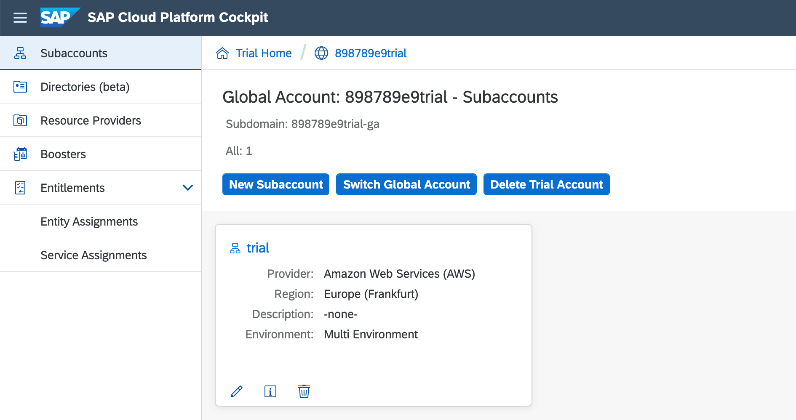
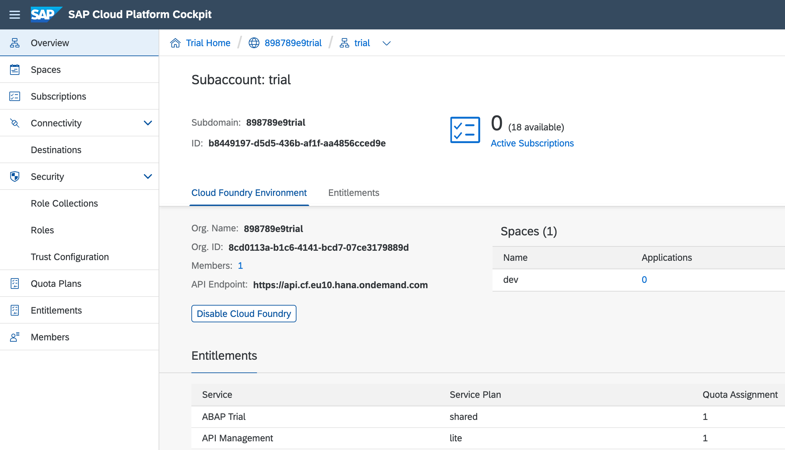
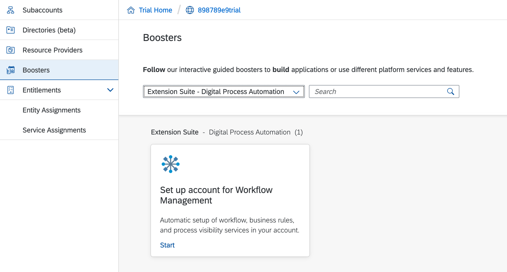

# Exercise 01 - Setting up for Workflow on Cloud Foundry

In this exercise you'll set up and configure the basic aspects that you'll need to complete this Workflow Virtual Event on SAP Cloud Platform, specifically in the Cloud Foundry (CF) environment.

This exercise assumes you have a fresh SAP Cloud Platform trial account; you may have to make adjustments if you've used some of your quota already on an existing trial account.

From a service perspective, you'll be using a number of services:

- Workflow: the engine and infrastructure that supports workflow generally
- Portal: to support the Fiori Launchpad (FLP) site which will host the Workflow-related apps
- HTML5 Application Repository: where the core Workflow-related apps are stored and served from
- Authorization & Trust Management: to manage application authorizations and trust to identity providers

You will also need an editor, or an Integrated Development Environment (IDE) to create and maintain your workflow definitions. For that you will be using the SAP Business Application Studio.

Finally, you'll be wearing different hats throughout this Virtual Event, using your SAP Cloud Platform trial user. To that end, you'll need appropriate roles, such as the following:

- Workflow Admin
- Workflow Context Viewer
- Workflow Developer
- Workflow Initiator
- Workflow Participant

This exercise helps you get started with setting things up, with the aid of an SAP Cloud Platform booster.

## Steps

After completing the steps in this exercise you'll have appropriate roles set up and assigned to your user, an IDE set up and configured to work with Workflow artifacts, and an instance of the main Workflow service set up explicitly, along side instances of some other related services. Instances of the Authorization & Trust Management and HTML5 Application Repository services mentioned earlier will be set up implicitly in the next exercise.

### 1. Log on to the SAP Cloud Platform Cockpit and look around

You'll be managing and using services via the SAP Cloud Platform Cockpit in this Virtual Event, so it's worth spending a couple of minutes making yourself familiar with it.

:point_right: Go to the trial cockpit landing page at <https://cockpit.hanatrial.ondemand.com/cockpit/#/home/trial> and log on if you're not already authenticated. You should be presented with a welcome page, with a button to "Enter Your Trial Account".

On entering your trial account, if you've created your SAP Cloud Platform trial account according to the [prerequisites](../../prerequisites.md), you should see something like this, showing a single SAP Cloud Platform subaccount named "trial" (this is the default name for a new, automatically provisioned subaccount) within your trial global account:



:point_right: Select your "trial" subaccount to get an overview, where you'll see that a CF organization has also been automatically provisioned for you and linked to the subaccount. If you chose the default location, the API endpoint for your CF organization will also be `https://api.cf.<region>.hana.ondemand.com` where region denotes the geographical location, such as `eu10` or `us10`. Note also that a default space called "dev" has been set up for you too:



:point_right: We'll be coming back to this page a number of times over the course of this Virtual Event, so it's a good idea to give this page a name we can refer to, and also to bookmark it. Let's call it "Trial Subaccount Home". Bookmark it now, with this name.

:point_right: In the menu on the left hand side, select "Spaces" to see the list of spaces in the CF organization - this should show your "dev" space as a tile, including the quota assigned to it and how much of that quota has been used. A newly provisioned CF organization and space should have adequate resources available for what we want to achieve in this Virtual Event today:


### 2. Use a booster to set up service instances and related artifacts

At this point you're ready to provision the service instances you'll need for your work with the Workflow service.

Until recently, this was done manually but the advent of SAP Cloud Platform [boosters](https://help.sap.com/viewer/65de2977205c403bbc107264b8eccf4b/Cloud/en-US/fb1b56148f834749a2bf51127421610b.html) make things simpler.

There's a booster available for Workflow Management. Boosters can be found via the "Boosters" menu item - which is at the global account level.

:point_right: Use the breadcrumb trail at the top of the cockpit page to navigate to the global account level. If you're following on from where you left off in the previous step, where you were viewing the "dev" space tile in the Cloud Foundry organization relating to your trial subaccount, the trail will look something like this:

```
Trial Home / 898789e9trial / trial
```

In this example, `898789e9trial` represents the global account, and `trial` represents the subaccount.

:point_right: Select the Boosters menu item and find the "Set up account for Workflow Management booster"; you can filter for it with the "Extension Suite - Digital Process Automation" value as shown.



The booster enables automatic setup of Cloud Platform artifacts focused around a certain topic or set of services. This one, relating to Workflow Management, actually sets up more than we'll need for this Virtual Event - it includes Business Rules and Process Visibility related artifacts. But that's fine for now; the important thing is that it will do the following for us:

- set appropriate service quotas
- create relevant service instances
- define destinations
- create and assign a role collection

:point_right: Start the booster, and wait for it to complete.


### 3. Check what the booster did for you

You may be curious as to exactly what the booster did. We got a rough idea from the progress indicator that was shown while the booster was working. But now let's take a quick look ourselves.

> In case you're wondering, the booster automatically identified and used the trial subaccount.

First, let's check

At this stage you're all set with the main Workflow service and have access to use it.


### 4. Set up the SAP Web IDE

Now it's time to set up the IDE you'll be using, which in this case is the SAP Web IDE. You'll configure it to use a special "Workflow Editor" extension, and also specify your CF details to connect to.

:point_right: Jump back to the landing page by clicking on the first element in the breadcrumb trail (this will be something like "Trial Home") at the top of the page, then use the "SAP Web IDE" button you saw earlier, to start the IDE, which should present itself to you like this:


There are different perspectives that this IDE supports, with icons on the far left to jump to them. The perspectives include "Home" (where you are now), "Editor" (identified with angle-brackets icon), "Storyboard" (rocket icon) and "Preferences" (cog icon). There may be a "Database Explorer" perspective available too (building blocks icon).

:point_right: Select the "Preferences" perspective, and within the "Workspace Preferences" choose first the "Cloud Foundry" entry. In the "Cloud Foundry Space" settings, specify the details for the API Endpoint, Organization and Space you're using. Remember that the API Endpoint is something that you looked at briefly earlier in this exercise. While specifying these details, you'll be asked to provide authentication information. Finally, don't forget to select the "Save" button at the bottom of the page.

What you end up with should look something like this:


:point_right: Now choose the "Extensions" entry within the "Workspace Preferences" and search for the "Workflow Editor" extension. Make sure it's switched to "ON" and hit "Save" at the bottom again. You may need to allow the IDE to restart at this point.


## Summary

At this point you're all set up to embark upon your Workflow service journey, with an instance of the main Workflow service available to you, and an IDE that can help you build and manage workflow definitions and make deployments to your CF environment on SAP Cloud Platform.


## Questions

1. What are the relationships between SAP Cloud Platform subaccounts, Cloud Foundry organizations and spaces?

1. While you've set up the SAP Web IDE, what other options might you have for this Virtual Event?
