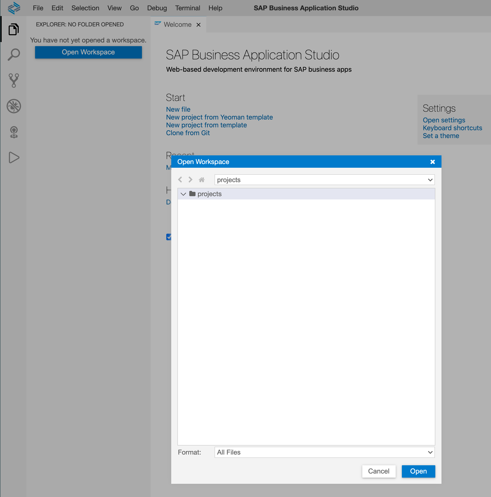
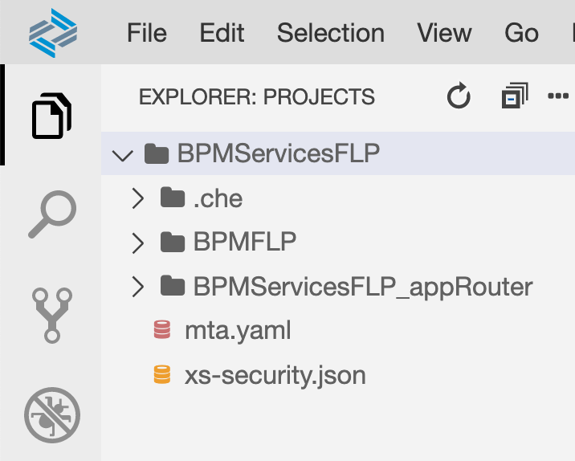

# Exercise 02 - Deploying the Workflow tools

In this exercise, you'll import a complete project into your IDE, build it, and deploy it to your Cloud Foundry (CF) "dev" space in the organization associated with your SAP Cloud Platform subaccount. This project contains everything you need to have a Fiori launchpad (FLP) site set up for you using the Portal service, and have injected into it tiles appropriate for accessing the Workflow related tools which you'll be using throughout the rest of this Virtual Event.


## Steps

After completing these steps you'll have an FLP site with, amongst other things, an app for viewing and processing Workflow items ("My Inbox") and a "Workflow Monitor" app for monitoring, starting and interacting with workflow definitions and instances.


### 1. Download the project ZIP file

The GitHub repository [SAP-samples/cloud-process-visibility](https://github.com/SAP-samples/cloud-process-visibility) contains a number of release artifacts. It's from here that you can download the project which contains all you need.

:point_right: Jump directly to the repository's [1.0.0 Release](https://github.com/SAP-samples/cloud-process-visibility/releases/tag/1.0.0) page and download the [BPMServicesFLP.zip](https://github.com/SAP-samples/cloud-process-visibility/releases/download/1.0.0/BPMServicesFLP.zip) file.


Once you have the ZIP file downloaded, unpack it into its own "BPMServicesFLP" directory. Here's what that looks like on a local computer:

```
i347491@C02CH7L4MD6T [~/Downloads]
▶ tree
.
├── BPMServicesFLP
│   ├── BPMFLP
│   │   ├── README.md
│   │   ├── package.json
│   │   ├── portal-site
│   │   │   ├── CommonDataModel.json
│   │   │   ├── business-apps
│   │   │   │   └── business-rules.json
│   │   │   └── i18n
│   │   │       ├── defaultCatalogId.properties
│   │   │       ├── defaultGroupId.properties
│   │   │       └── workflow.properties
│   │   └── xs-app.json
│   ├── BPMServicesFLP_appRouter
│   │   ├── package.json
│   │   └── xs-app.json
│   ├── mta.yaml
│   └── xs-security.json
└── BPMServicesFLP.zip

6 directories, 13 files
```

### 2. Bring the project into App Studio

It's easy to bring such a project into your App Studio Dev Space. First, you need to make sure that you have a workspace opened in the Explorer. Then, you just need to drag the project folder into there.

:point_right: Switch to the Explorer perspective in App Studio using the folders icon in the far left hand side, and use the Open Workspace button to select and open the "projects" directory.



> The App Studio gives you a local filesystem to work within; it even has a Terminal that you can start up, to navigate that filesystem and run commands.

:point_right: Using your local computer's file system tools, find and drag the "BPMServicesFLP" directory into the Explorer space in the App Studio, and expand it. You should end up with something that looks like this:




### 3. Explore the project contents

What is there in this project? What are the different files and directories? What's going to happen next? It's worth taking a couple of minutes to [stare](https://langram.org/2017/02/19/the-beauty-of-recursion-and-list-machinery/#initialrecognition) at the contents of this project to understand some details of what we're about to deploy.

:point_right: Take a look through the file and directory structure, which you can see by navigating it in the Explorer perspective (you can also see the details in the tree structure above).

Here's what you'll see, in an order that will hopefully make sense:

> In case you're left still wondering - the `.che/` directories are specific to the IDE itself, we can safely ignore those at this level of exploration.

**File: `mta.yaml`**

The `mta.yaml` file within the project contains the definitions of the modules that will be deployed to SAP Cloud Platform, and also a specification of the resources upon which these modules rely. There are two modules defined:

|Module|Description|
|-|-|
|`BPMFLP`|When deployed, this module will cause application and tile definitions to be added to the FLP site. The module itself is to be found in the `BPMFLP` directory in the project structure. It relies upon instances of a number of services, including the Workflow and Portal services. This module executes as a one-time task, and stops upon completion. Keep this in mind when you look at the applications in the SAP Cloud Platform Cockpit later on - it will be in a "STOPPED" (i.e. completed) state.
|`BPMServicesFLP_appRouter`|This is the Approuter-based module that handles traffic to and serves the FLP site and apps within it. It relies upon instances of the same services as the `BPMFLP` module, plus another one - the HTML5 Application Repository service.|

**File: xs-security.json**

This file contains the parameters that are relevant when instantiating an "application" plan of the Authorization & Trust Management service (also known as "xsuaa"); in the `mta.yaml` file, the definition of the resource `uaa_bpmservices` (upon which both modules rely) includes a reference to this file.

**Directory: `BPMFLP/`**

This directory contains the files for the `BPMFLP` module. Taking a brief look inside, we see that it's a Node.js based module, where (by looking in the `package.json` file) we see that content is deployed by means of the `@sap/portal-cf-content-deployer` package. The content itself is to be found defined in the `portal-site/` subdirectory.

**Directory: `BPMServicesFLP_appRouter`**

Not unexpectedly, this directory contains the files for the `BPMServicesFLP_appRouter` module. Looking inside this directory's `package.json` file, we see that the `@sap/approuter` is employed. Perhaps more importantly, the `xs-app.json` file is what the Approuter uses to know what to serve, and how.


## Summary


## Questions

1. MODIFY Why is the workflowtilesFLP app not listed in the "Referencing Applications" column for the instance of the html5-apps-repo service?

2. What do you think the difference between a "workflow instance" and a "workflow definition" is?

3. Can you find out what the ID of the "Monitor Workflow" app is, that is accessed through the two "Monitor Workflow" tiles?

4. What are all the services upon which the BPMFLP module relies?
